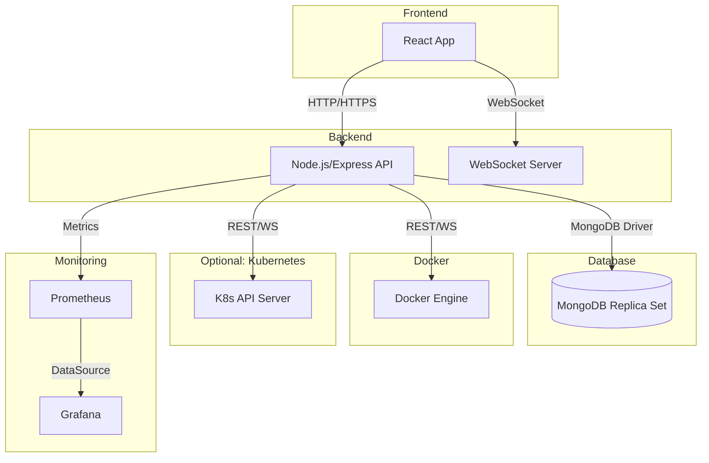
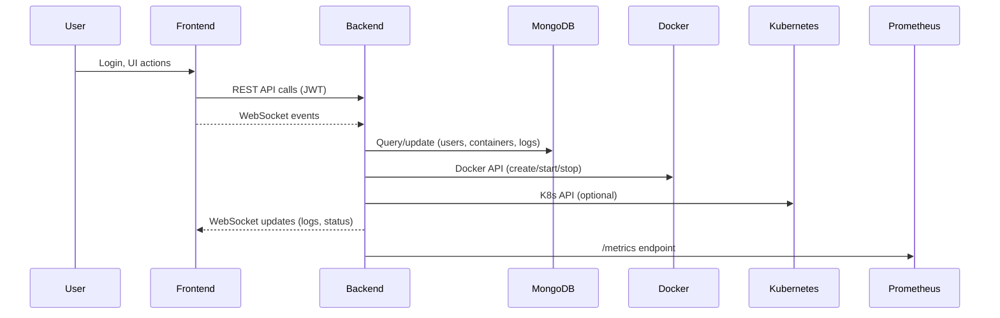

# Orchestrator Application Design

## Overview
Orchestrator is a highly-available, container-based application management platform with a web frontend and a Node.js/Express backend, supporting Docker and Kubernetes environments. It provides secure, multi-user access, real-time monitoring, and integrates with MongoDB for persistent storage.

---

## Architecture Diagram


---

## Components

### 1. Frontend (React)
- **Features:**
  - User authentication (JWT-based)
  - Container management UI (create, start, stop, logs, metrics)
  - Dockerfile editor with syntax highlighting
  - Real-time updates via WebSocket
  - Monitoring dashboards (integrated with Prometheus/Grafana)
- **Tech:** React, CSS, WebSocket, REST API

### 2. Backend (Node.js/Express)
- **Features:**
  - REST API for all app operations
  - WebSocket server for real-time events
  - Docker API integration (via dockerode)
  - Kubernetes API integration (optional)
  - MongoDB for persistent storage (users, containers, logs, metrics)
  - Authentication & authorization (JWT, bcrypt)
  - Rate limiting, logging, validation, CORS
- **Tech:** Node.js, Express, dockerode, mongoose, ws, jsonwebtoken, bcrypt

### 3. Database (MongoDB Replica Set)
- **Features:**
  - Stores users, containers, logs, metrics
  - Replica set for high availability
  - Auth enabled, secrets managed via Kubernetes
- **Tech:** MongoDB 6.x, StatefulSet, PVC

### 4. Monitoring
- **Prometheus:** Scrapes backend metrics endpoints
- **Grafana:** Visualizes metrics, dashboards for containers, system health

### 5. Ingress/Proxy
- **Nginx:** SSL termination, static frontend, API proxy, security headers
- **Kubernetes Ingress:** For cloud/HA deployments

---

## Data Flow


---

## Security
- **Authentication:** JWT tokens, bcrypt password hashing
- **Authorization:** Role-based (admin/user), API route guards
- **Transport:** HTTPS everywhere (nginx, backend, frontend)
- **Secrets:** Managed via Kubernetes secrets, not in code
- **CORS:** Configurable, strict origin policy
- **Rate Limiting:** Prevents brute force and abuse
- **Logging:** Centralized, JSON format, log rotation
- **Network Policies:** Kubernetes network segmentation

---

## Scalability & High Availability
- **Backend:** Multiple replicas, stateless, behind load balancer
- **Frontend:** Served as static files, horizontally scalable
- **MongoDB:** Replica set, persistent volumes
- **Ingress:** Nginx or K8s Ingress, supports SSL and sticky sessions
- **Autoscaling:** HPA for backend, resource requests/limits set
- **Monitoring:** Prometheus + Grafana for alerting and dashboards

---

## Deployment
- **Docker Compose:** For local development
- **Kubernetes:** For production/HA, with manifests for all components
- **CI/CD:** Build, test, and push images to local or remote registry
- **TLS:** Certificates managed via secrets, mounted into nginx/backend
- **Init Scripts:** MongoDB replica set/init users via ConfigMap

---

## File/Directory Structure
```
Orchestrator/
  backend_orchestrator/   # Node.js/Express backend
  frontend_orchestrator/  # React frontend
  k8s/                    # Kubernetes manifests
  nginx/                  # Nginx config
  mongo/                  # MongoDB init scripts
  docker-compose.yml      # Local dev
  README.md, APPLICATION_DESIGN.md
```

---

## Onboarding Checklist
- [ ] Clone repo, install dependencies
- [ ] Set up .env files or Kubernetes secrets
- [ ] Build and run with Docker Compose or deploy to K8s
- [ ] Access frontend via HTTPS, login as admin
- [ ] Create/manage containers, view logs/metrics
- [ ] Review monitoring dashboards
- [ ] Read this design doc and README for details

---

## Further Reading
- [README.md](./README.md)
- [Kubernetes manifests](./k8s/)
- [Backend code](./backend_orchestrator/)
- [Frontend code](./frontend_orchestrator/) 